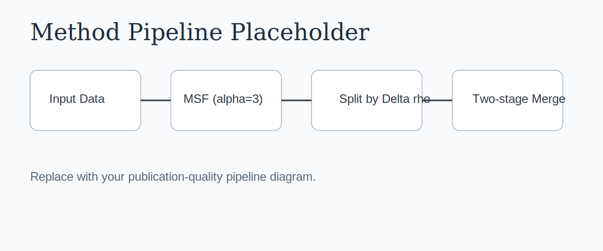
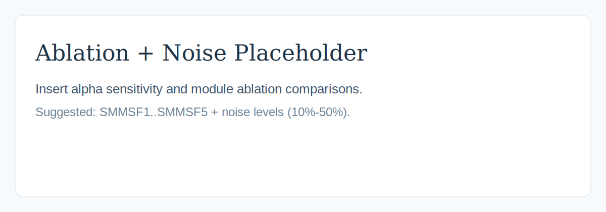

# SMMSF: Density-Increment and Cut-Edge Optimized Clustering via Minimum Spanning Forest

<p align="center">
  
</p>

<p align="center">
  <a href="https://doi.org/10.1016/j.neucom.2026.132957"></a>
  
  
</p>

Official-style implementation and project page for **SMMSF** (split-and-merge clustering via MSF):

- **Paper**: *Density-increment and cut-edge optimized clustering via minimum spanning forest*
- **Venue**: Neurocomputing, 2026, Volume 674, Article 132957
- **DOI**: `10.1016/j.neucom.2026.132957`

This repository now contains:
- Original MATLAB implementation.
- New Python implementation aligned with the MATLAB workflow.
- Placeholder figures for publication-style GitHub presentation.

## Abstract
Graph-based clustering methods often suffer from limited local-structure preservation when using either kNN graphs or a single MST. SMMSF addresses this with a multi-stage pipeline: construct an MSF by combining multiple MST rounds, split data using density-increment peaks, and merge clusters through a two-stage topology-aware process using cut vertices and cut edges. The method is robust across varying densities, irregular cluster shapes, and moderate noise.

## Method Overview
<p align="center">
  
</p>

### 1) MSF Construction
- Build `T1, T2, ..., T_alpha` iteratively by removing previous MST edges.
- Use `F_alpha = T1 ∪ T2 ∪ ... ∪ T_alpha` as the final graph.
- In the paper and code, the default is `alpha = 3`.

### 2) Density-Increment Splitting
- Compute local density on `T1` and `F_alpha`.
- Define density increment:

```text
Delta_rho(x_i) = rho_alpha(x_i) - rho_1(x_i)
```

- Traverse from non-peak nodes to neighboring nodes with maximum `Delta_rho` until reaching a density-increment peak.
- Each peak induces an initial sub-cluster.

### 3) Two-Stage Merging
- Stage-1: merge adjacent small clusters with geometric constraints.
- Stage-2: repeatedly merge cluster pairs with largest topology-aware inter-cluster score derived from cut vertices and cut edges.
- Stop when cluster count reaches target `K`.

## Repository Layout
```text
.
├── SMMSF_clustering.m      # MATLAB entry
├── kmst.m                  # build MST_1 and MST_3
├── splitTree.m             # density-increment split
├── TwoRoundMerge.m         # two-stage merge
├── python/
│   ├── smmsf.py            # Python implementation
│   ├── run_smmsf.py        # CLI for CSV data
│   └── README.md
├── assets/figures/         # publication-style placeholders
└── requirements.txt        # Python dependencies
```

## Quick Start
### MATLAB
```matlab
% data: N x D matrix
% K: number of clusters
IDX = SMMSF_clustering(data, K);
```

### Python
```bash
pip install -r requirements.txt
python python/run_smmsf.py --input data.csv --k 4 --output labels.csv
```

Python API:
```python
import numpy as np
from python.smmsf import smmsf_clustering

data = np.loadtxt("data.csv", delimiter=",")
labels = smmsf_clustering(data, k=4)
```

## Experimental Protocol (Paper-Aligned)
- 12 synthetic 2D datasets and 15 real datasets.
- External metrics: `AC`, `PR`, `RE`, `F1`, `ARI`, `NMI`.
- Internal metrics: `SI`, `DBI`.
- Noise robustness evaluated at 10% to 50% extra noise.
- Ablations include `alpha` variants and split/merge module removals.

## Result Figures (Placeholders)
Replace placeholder files with your final publication figures:

<p align="center">
  
</p>

<p align="center">
  
</p>

<p align="center">
  
</p>

## Citation
```bibtex
@article{zhai2026smmsf,
  title   = {Density-increment and cut-edge optimized clustering via minimum spanning forest},
  author  = {Zhai, Haoyu and Yang, Jie and Guo, Hantao and Wang, Bin and Ma, Yan},
  journal = {Neurocomputing},
  volume  = {674},
  pages   = {132957},
  year    = {2026},
  doi     = {10.1016/j.neucom.2026.132957}
}
```

## Notes
- Figure files in `assets/figures/` are placeholders by design and can be directly replaced.
- Python labels are 1-based to match MATLAB outputs.
